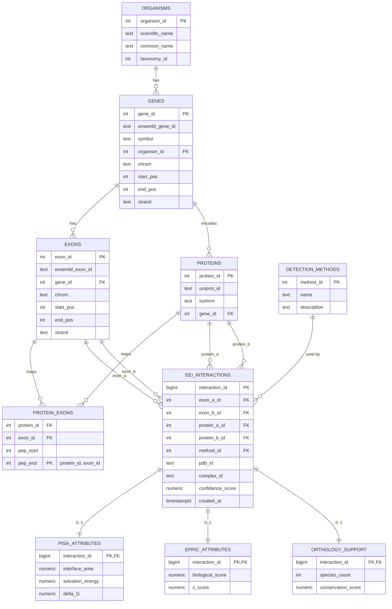

```mermaid
erDiagram
  ORGANISMS {
    int organism_id PK
    text scientific_name
    text common_name
    int taxonomy_id
  }

  GENES {
    int gene_id PK
    text ensembl_gene_id
    text symbol
    int organism_id FK
    text chrom
    int start_pos
    int end_pos
    text strand
  }

  PROTEINS {
    int protein_id PK
    text uniprot_id
    text isoform
    int gene_id FK
  }

  EXONS {
    int exon_id PK
    text ensembl_exon_id
    int gene_id FK
    text chrom
    int start_pos
    int end_pos
    text strand
  }

  PROTEIN_EXONS {
    int protein_id FK
    int exon_id FK
    int pep_start
    int pep_end
    PK "protein_id, exon_id"
  }

  DETECTION_METHODS {
    int method_id PK
    text name
    text description
  }

  EEI_INTERACTIONS {
    bigint interaction_id PK
    int exon_a_id FK
    int exon_b_id FK
    int protein_a_id FK
    int protein_b_id FK
    int method_id FK
    text pdb_id
    text complex_id
    numeric confidence_score
    timestamptz created_at
  }

  PISA_ATTRIBUTES {
    bigint interaction_id PK, FK
    numeric interface_area
    numeric solvation_energy
    numeric delta_G
  }

  EPPIC_ATTRIBUTES {
    bigint interaction_id PK, FK
    numeric biological_score
    numeric z_score
  }

  ORTHOLOGY_SUPPORT {
    bigint interaction_id PK, FK
    int species_count
    numeric conservation_score
  }

  ORGANISMS ||--o{ GENES : "has"
  GENES ||--o{ EXONS : "has"
  GENES ||--o{ PROTEINS : "encodes"
  PROTEINS ||--o{ PROTEIN_EXONS : "maps"
  EXONS ||--o{ PROTEIN_EXONS : "maps"
  DETECTION_METHODS ||--o{ EEI_INTERACTIONS : "used by"
  EXONS ||--o{ EEI_INTERACTIONS : "exon_a"
  EXONS ||--o{ EEI_INTERACTIONS : "exon_b"
  PROTEINS ||--o{ EEI_INTERACTIONS : "protein_a"
  PROTEINS ||--o{ EEI_INTERACTIONS : "protein_b"
  EEI_INTERACTIONS ||--|| PISA_ATTRIBUTES : "0..1"
  EEI_INTERACTIONS ||--|| EPPIC_ATTRIBUTES : "0..1"
  EEI_INTERACTIONS ||--|| ORTHOLOGY_SUPPORT : "0..1"
```
